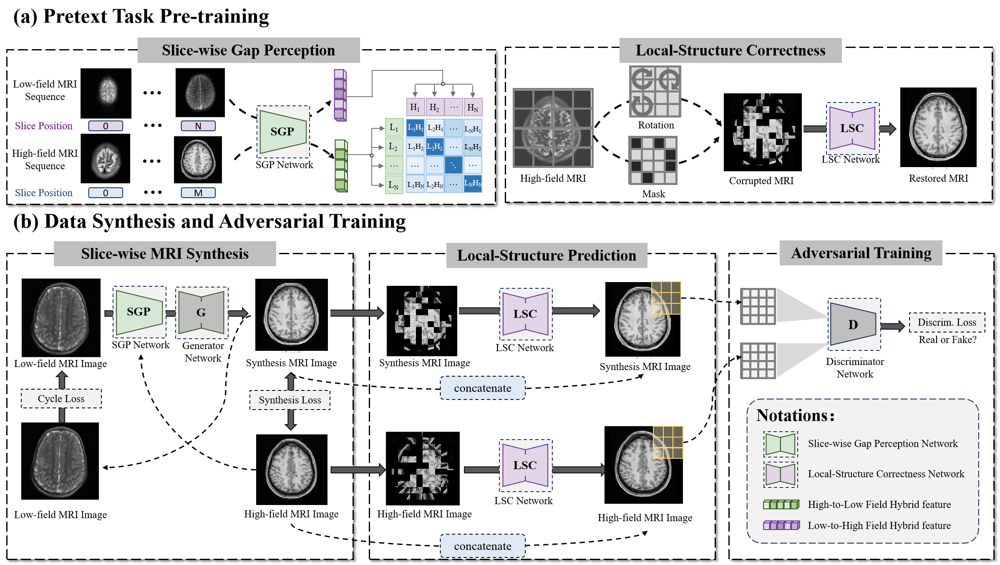

# Pretext Task Adversarial Learning for Unpaired Low-field to Ultra High-field MRI Synthesis

> 🚀 A deep learning framework for unpaired high-field MRI synthesis.


---

## 📖 Table of Contents
- [Abstract](#abstract)
- [Installation](#installation)
- [Usage](#usage)
- [Dataset](#dataset)
- [Model Architecture](#model-architecture)
- [Results](#results)

---

## 🧠 Abstract
High-field MRI synthesis holds significant potential in overcoming data scarcity for downstream tasks (e.g., segmentation). Low-field MRI images often suffer from reduced signal-to-noise ratio (SNR) and spatial resolution, making high-field synthesis crucial for better clinical insights. However, ensuring anatomical accuracy and preserving fine details in synthetic high-field MRI remains challenging.

We introduce the **Pretext Task Adversarial (PTA) Learning Framework**, which includes:

- **Slice-wise Gap Perception (SGP) Network**: Aligns slice inconsistencies between low-field and high-field datasets using contrastive learning.
- **Local Structure Correction (LSC) Network**: Enhances anatomical structures by restoring locally rotated and masked images.
- **Pretext Task-Guided Adversarial Training**: Incorporates a discriminator and additional supervision to improve realism.

Extensive experiments on low-field to ultra high-field MRI synthesis demonstrate **state-of-the-art performance**, achieving **16.892 FID, 1.933 IS, and 0.324 MS-SSIM**, enabling the generation of high-quality high-field-like MRI data to enhance training datasets for downstream applications.

---

## ⚙️ Installation
Clone the repository:
```bash
git clone https://github.com/xxx.git
```
Install the required packages:
```bash
pip install -r requirements.txt
```

---

## 🚀 Usage
To train the model(hybrid-version):
```bash 
python train.py --dataroot /media/USER_PATH/npy --name test  --model pta_hybrid --display_id -1 --checkpoints_dir /media/USER_PATH/output/repo_test --load_size=224 --n_epochs 100 --batch_size 16 --input_nc 1 --output_nc 1 --n_epochs_decay 50  --preprocess resize --save_epoch_freq=5 --netG=hybrid  --dataset_mode unaligned_mask --gpu_ids 0
```
Notable arguments include:

- **dataroot**: Datapath to your folder.
- **model**: Which model structure you want to train.
- **load_size**: The shape of your image.
- **net_G**: Which generator you want to use.
- **preprocess**: Which preprocess method want to apply.
- **dataset_mode**: For hybrid model, unaligned mask; for others unaligned.

---

## 📂 Dataset&Preparation
Our framework is evaluated on diverse datasets:
- **Low-field MRI datasets:** M4RAW, LISA
- **High-field MRI datasets:** fastMRI, HCP1200
Run the code
```bash preprocessing_images.py ```
to process images in the proper format for PTA_hybrid and getting the masks.
Then prepare two directories to host training images from domain A '/path/to/data/trainA' and from domain B '/path/to/data/trainB' respectively. You can train the model with the dataset flag '--dataroot /path/to/data'.
Similarly, you need to prepare two directories:'/path/to/data/testA' and '/path/to/data/testB' during test time. All data are suggested to converting to 'png' format. 
More details on data preparation can be found in the [dataset documentation](dataset/README.md).

---

## 🏗 Model Architecture
 
The PTA learning framework consists of:
1. **SGP Network:** Mitigates inter-slice misalignment via contrastive learning.
2. **LSC Network:** Enhances fine-grained anatomical details through local corrections.
3. **CycleGAN-based Adversarial Training:** Ensures realism and structure preservation.

---

## 📊 Results
| Method  | FID ↓ | IS ↑ | MS-SSIM ↓ |
|---------|------|------|----------|
| Syn-GAN  | 171.009 | 1.131 | 0.989 |
| ESR-GAN  | 184.045 | 1.627 | 0.406 |
| CycleGAN | 61.470 | 2.068 | 0.201 |
| **PTA (Ours)** | **16.892** | **1.933** | **0.324** |

PTA achieves superior synthesis quality, maintaining both **fidelity and diversity**, outperforming existing methods in high-field MRI generation.

---

## 📜 License
This project is licensed under the **MIT License**.

