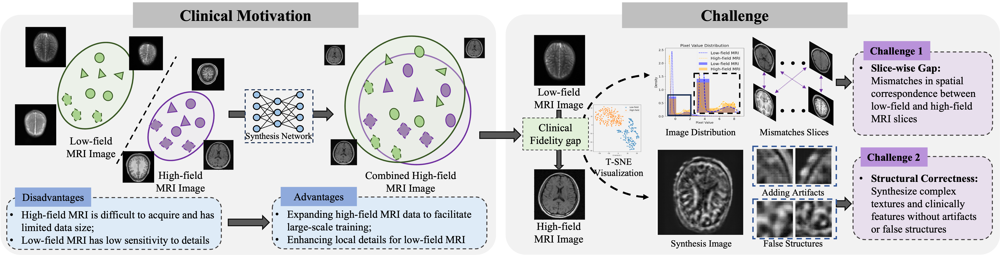

# Pretext Task Adversarial Learning for Unpaired Low-field to Ultra High-field MRI Synthesis

> A deep learning framework for unpaired high-field MRI synthesis. 🚀  

---

## 📖 Table of Contents
- [Abstract](#Abstract)
- [Installation](#installation)
- [Usage](#usage)
- [Dataset](#dataset)
- [Model Architecture](#model-architecture)
- [Results](#results)

---
 
## Abstract
Given the scarcity and cost of high-field MRI, the synthesis of high-field MRI from low-field MRI holds significant potential when there is limited data for training downstream tasks (e.g. segmentation). Low-field MRI often suffers from a reduced signal-to-noise ratio (SNR) and spatial resolution compared to high-field MRI. However, synthesizing high-field MRI data presents challenges. These involve aligning image features across domains while preserving anatomical accuracy and enhancing fine details. To address these challenges, we propose a Pretext Task Adversarial (PTA) learning framework for high-field MRI synthesis from low-field MRI data. The framework comprises three processes: (1) The slice-wise gap perception (SGP) network aligns the slice inconsistencies of low-field and high-field datasets based on contrastive learning. (2) The local structure correction (LSC) network extracts local structures by restoring the locally rotated and masked images. (3) The pretext task-guided adversarial training process introduces additional supervision and incorporates a discriminator to improve image realism. Extensive experiments on low-field to ultra high-field task demonstrate the effectiveness of our method, achieving state-of-the-art performance (16.892 in FID, 1.933 in IS, and 0.324 in MS-SSIM). This enables the generation of high-quality high-field-like MRI data from low-field MRI data to augment training datasets for downstream tasks.

---

## Installation

---

## Usage

---

## Dataset

---

## Model Architecture

---

## Results
